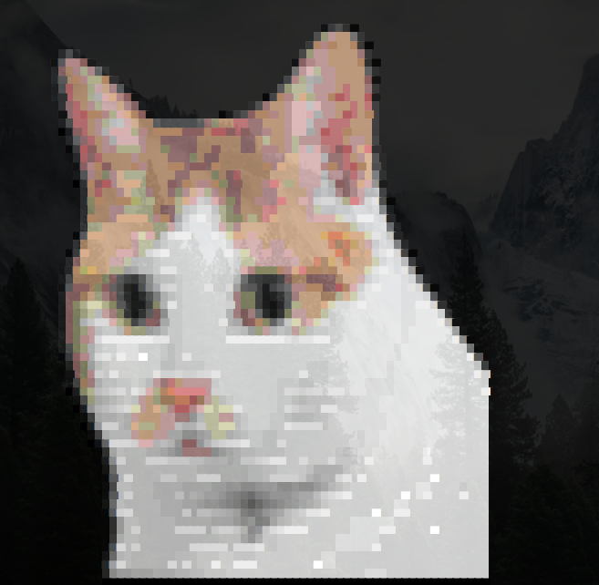

# niba
cat this cat in your bash_profile, Niba the cat is watching you!

just add "cat niba.txt" to your .bash_profile or whatever profile/rc file for your bash.

## preview

This cat "Niba" is my sister dudulee's cat. This image is created by <https://github.com/rossy/img2xterm>
